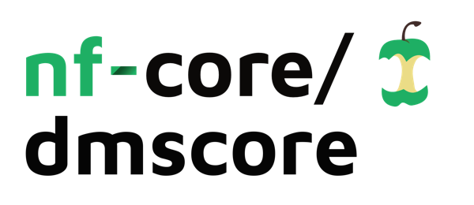

<h1>
  <picture>
    <source media="(prefers-color-scheme: dark)" srcset="docs/images/nf-core-dmscore_logo_dark.png">
    
  </picture>
</h1>

[](https://github.com/nf-core/dmscore/actions/workflows/ci.yml)
[](https://github.com/nf-core/dmscore/actions/workflows/linting.yml)[](https://nf-co.re/dmscore/results)[](https://doi.org/10.5281/zenodo.XXXXXXX)
[](https://www.nf-test.com)

[](https://www.nextflow.io/)
[](https://docs.conda.io/en/latest/)
[](https://www.docker.com/)
[](https://sylabs.io/docs/)
[](https://cloud.seqera.io/launch?pipeline=https://github.com/nf-core/dmscore)

---

## 1. Overview
**nf-core/dms** is a reproducible, scalable, and community-curated pipeline for analyzing deep mutational scanning (DMS) data using shotgun DNA sequencing. DMS enables researchers to measure the fitness effects of thousands of gene variants simultaneously, helping to classify disease causing mutants in human and animal populations, to learn fundamental rules of virus evolution, protein architecture, splicing or small-molecule interactions.

While DNA synthesis and sequencing technologies have advanced substantially, long open reading frame (ORF) targets still present major challenges for DMS studies. Shotgun DNA sequencing can be used to greatly speed up the inference of long ORF mutant fitness landscapes, theoretically at no expense in accuracy. We have designed the **nf-core/dms** pipeline to unlock the power of shotgun sequencing based DMS studies, to simplify and standardise the complex bioinformatics steps involved in data processing of such experiments – from read alignment to QC reporting and fitness landscape inferences.

> 📄 Reference: Wehnert et al., _bioRxiv_ preprint (coming soon)

---

## 2. Features of nf-core/dms
- End-to-end analyses of DMS shotgun sequencing data
- Modular, three-stage workflow: alignment → QC → error-aware fitness estimation
- Integrates with popular statistical tools like [DiMSum](https://github.com/lehner-lab/DiMSum), [Enrich2](https://github.com/FowlerLab/Enrich2), [Rosace](https://github.com/pimentellab/rosace/) and [mutscan](https://github.com/fmicompbio/mutscan)
- Supports multiple mutagenesis strategies, e.g. nicking by NNK and NNS codons
- Containerized via Docker, Singularity and Apptainer
- Scalable across HPC and Cloud systems
- Monitors CPU, memory, and CO₂ usage

---

## 3. Installation
**nf-core/dms** uses [Nextflow](https://nf-co.re/docs/usage/getting_started/installation), which must be installed on your system:

```bash
java -version                           # Check that Java v11+ is installed
curl -s https://get.nextflow.io | bash  # Download Nextflow
chmod +x nextflow                       # Make executable
mv nextflow ~/bin/                      # Add to user's $PATH
```

The pipeline itself requires no installation – Nextflow will fetch it directly from GitHub:

```bash
nextflow run nf-core/dms -profile docker
```

---

## 4. Usage
Prepare:
- A **sample sheet** CSV to specify input/output labels, replicates, etc. (see [example](assets/samplesheet.csv))
- A **reference FASTA** file for the gene or region of interest

To execute **nf-core/dms**, run the basic command:

```bash
nextflow run nf-core/dms \
  -profile singularity,local \
  --input ./input.csv \
  --outdir ./results \
  --fasta ./ref.fa \
  --reading-frame 1-300 \
  --mutagenesis NNK-NNS \
  --seq-rarefaction false
```

### Required parameters

| Parameter          | Description                                         |
|--------------------|-----------------------------------------------------|
| `--input`          | Path to sample sheet CSV                            |
| `--outdir`         | Path to output directory                            |
| `--fasta`          | Reference FASTA file                                |
| `--reading_frame`  | Start and end nucleotide (e.g. `1-300`)             |

### Optional parameters

| Parameter              | Default     | Description                                     |
|------------------------|-------------|-------------------------------------------------|
| `--read-align`         | `bwa-mem`   | Read aligner                                    |
| `--mutagenesis`        | `NNK-NNS`   | Deep mutational scanning strategy used          |
| `--seq-rarefaction`    | `false`     | Estimate sequencing saturation by rarefaction   |
| `--error-estimation`   | `input`     | Error model used to correct 1nt counts          |
| `--fitness-estimation` | `dimsum`    | Downstream fitness inference module             |

More options and advanced configuration: [see vignette](link)

---

## 5. Input Data

The primary pipeline input is a sample sheet `.csv` file listing:

- Paths to paired-end `.fastq.gz` files from shotgun sequencing
- Their classification as either input or output samples
- Replicate IDs
- Associated experimental metadata

See [sample CSV](link) for formatting.

---

## 6. Output Data

After execution, the pipeline creates the following directory structure:

```
results/
├── plots/               # PDF visualizations: coverage, variant heatmaps, etc.
├── intermediate_files/  # Raw alignments, filtered variant tables, QC reports
├── final_files/         # Fitness and error tables from downstream tools
├── timeline.html        # Runtime timeline
└── report.html          # Summary report incl. resource and CO₂ usage
```

---

## 7. Citation

If you use this pipeline in your research, please cite:
> 📄 Wehnert et al., _bioRxiv_ preprint (coming soon)

Please also cite the nf-core framework:
> 📄 Ewels et al., _Nature Biotechnology_, 2020  
> [https://doi.org/10.1038/s41587-020-0439-x](https://doi.org/10.1038/s41587-020-0439-x)

---

## 8. License

[MIT License](link)

&copy; 2025 Benjamin Wehnert, Taylor Mighell, Fei Sang, Ben Lehner, Maximilian Stammnitz

---

## 9. Contributing

We welcome contributions from the community!

Please open an [issue](../../issues/new) or [pull request](../../compare) via this GitHub page, to:
- Suggest or help implementing new modules for custom workflows
- Report bugs and other challenges in running **nf-core/dms**
- Help improve this documentation

You can also reach out to us via the **nf-core Slack**, by use of the `#dms` channel ([join here](https://join.slack.com/share/enQtOTMyMDc3MTA0Mzg0Mi04YmRiNDEwZTBlOTRiN2M2ZGU5ZGVmOWQ3YzA0YjA4NzhiNjFhNTVlNDA4ZTZjOTE2MjE5MmIzYWZjZTljMTE3)).

---

## 10. Contact

For detailled scientific or technical questions, feedback and experimental discussions, feel free to contact us directly:

- Benjamin Wehnert — wehnertbenjamin@gmail.com  
- Maximilian Stammnitz — maximilian.stammnitz@crg.eu

---
